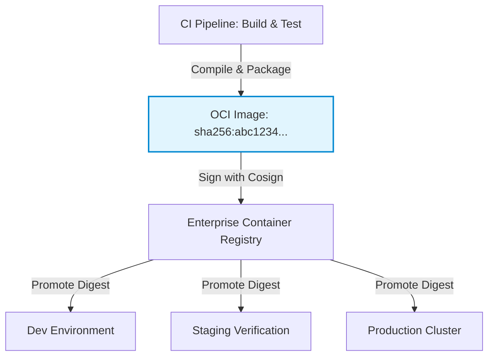

# ADR-0004: Immutable Digest Container Promotion Lifecycle

* Status: accepted
* Deciders: Platform Architecture WG, Security Engineering, Release Engineering
* Date: 2024-02-18
Technical Story: PLAT-120
* Category: Release Engineering
* Depends on: ADR-0002
* Required by: ADR-0007, ADR-0015, ADR-0016

## Context and Problem Statement

Teams frequently rebuilt container images when promoting code from testing to staging and production, leading to subtle runtime discrepancies caused by upstream package updates, differing build-time timestamps, or floating base tags. We required a deterministic, verifiable artifact promotion pipeline where what is tested in staging is bit-for-bit identical to what runs in production.

## Decision Drivers

* Elimination of environment drift between pre-production testing and production execution
* Cryptographically auditable provenance from source commit to deployed container
* Rapid rollback speed avoiding rebuild cycles during operational incidents

## Considered Options

* Option 1: Build Once and Promote by Immutable SHA-256 Digest
* Option 2: Rebuild image per environment using environment-specific Dockerfiles

## Decision Outcome

Chosen option: "Build Once and Promote by Immutable SHA-256 Digest", because Deterministic deployment guarantees require content-addressable immutability. The SHA-256 image digest represents a verifiable artifact contract that cannot be altered or spoofed after verification.

### Positive Consequences

* Staging verification directly certifies the exact binary payload that runs in production.
* Rollbacks execute in seconds by repointing deployments to a previous known-good digest.
* Enables binary authorization and cryptographic signature verification before pod scheduling.

### Negative Consequences

* Forces absolute externalization of environment configurations and credentials.
* Artifact storage footprint increases, requiring automated lifecycle pruning for untagged historical digests.

### Architecture Topology

## Pros and Cons of the Options

### Option 1: Build Once and Promote by Immutable SHA-256 Digest

Build and test the OCI container image once in CI, publish by content addressable sha256 digest, and promote that exact digest across all environments.

* Good, because Guaranteed identical binary execution across environments
* Good, because Cryptographic verification via digital signatures
* Good, because Fast promotions requiring zero recompilation
* Bad, because Configuration cannot be baked into images and must be strictly externalized
* Bad, because Requires robust multi-tenant container registry with replication

### Option 2: Rebuild image per environment using environment-specific Dockerfiles

Trigger separate builds with environment flags in each deployment pipeline.

* Good, because Allows embedding environment specifics into static artifacts
* Bad, because Destroys auditability; staging verification does not prove production stability
* Bad, because Vulnerable to upstream dependency drift during emergency hotfixes

## Links and Primary Sources

### Internal Platform Links
* [ADR-0002: Semantic Versioning and Release Tagging Standards](0002-semantic-versioning-and-release-tagging.md)
* [ADR-0015: Declarative GitOps Application Delivery](0015-declarative-gitops-continuous-delivery.md)

### Canonical Primary Sources
* [OCI Image Format Specification](https://opencontainers.org/specs/image/)

