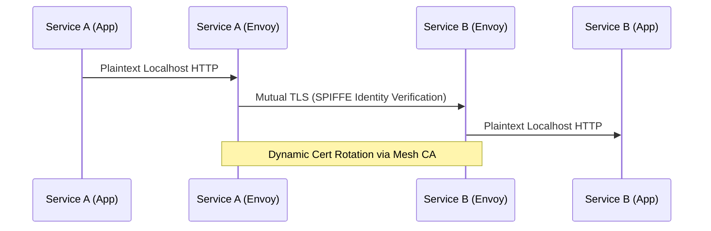

# ADR-0007: Service Mesh Mutual TLS and Zero-Trust Traffic Policy

* Status: accepted
* Deciders: Security Engineering Guild, Platform Architecture WG
* Date: 2024-03-29
Technical Story: PLAT-142
* Category: Networking and Security
* Depends on: ADR-0004, ADR-0011
* Required by: ADR-0013, ADR-0025

## Context and Problem Statement

With the migration toward distributed microservices running across multi-tenant container clusters, internal network traffic traversed flat cluster overlay networks without encryption or cryptographic identity validation. Any compromised pod could theoretically sniff internal payload traffic or spoof RPC requests to privileged backend payment and customer services.

## Decision Drivers

* Enforce zero-trust network posture: encrypt all transit traffic by default
* Cryptographic SPIFFE/SPIRE pod identity validation independent of IP addresses
* Centralized layer 7 authorization policies without bespoke application code

## Considered Options

* Option 1: Envoy-based Sidecar Service Mesh (Istio / Linkerd)
* Option 2: Application-Level TLS (mTLS configured within language runtimes)

## Decision Outcome

Chosen option: "Envoy-based Sidecar Service Mesh (Istio / Linkerd)", because A sidecar service mesh provides verifiable cryptographic identity and ubiquitous in-transit encryption across polyglot microservices without pushing certificate lifecycle toil onto application teams.

### Positive Consequences

* All internal pod-to-pod communication is encrypted with modern TLS 1.3 ciphers.
* Security policies enforce least-privilege traffic access via declarative AuthorizationPolicy resources.
* Generates rich golden-signals telemetry out of the box.

### Negative Consequences

* Sidecar memory consumption requires careful resource profiling and proxy tuning.
* Complex debugging workflows when proxy configurations conflict with application keep-alives.

### Architecture Topology

## Pros and Cons of the Options

### Option 1: Envoy-based Sidecar Service Mesh (Istio / Linkerd)

Inject lightweight sidecar proxies into every pod to automatically negotiate mTLS, manage short-lived certificates, and enforce L7 authorization policies.

* Good, because Transparent mTLS without altering application code
* Good, because Granular traffic splitting, circuit breaking, and telemetry generation
* Good, because Automatic short-lived certificate rotation
* Bad, because Adds 1-3ms network hop latency per service hop
* Bad, because Increases container memory consumption per pod

### Option 2: Application-Level TLS (mTLS configured within language runtimes)

Manage TLS certificates and keystores directly in language services.

* Good, because No sidecar proxy memory overhead
* Bad, because Massive developer overhead managing certificate libraries across polyglot languages
* Bad, because High risk of misconfiguration and manual certificate expiry outages

## Links and Primary Sources

### Internal Platform Links
* [ADR-0004: Immutable Digest Container Promotion Lifecycle](0004-immutable-digest-container-promotion.md)
* [ADR-0011: Workload Identity Federation for Cloud Resources](0011-workload-identity-federation.md)
* [ADR-0013: Progressive Delivery and Canary Traffic Splitting](0013-progressive-delivery-and-canary-rollouts.md)

### Canonical Primary Sources
* [SPIFFE Standard: Secure Production Identity Framework](https://spiffe.io)

