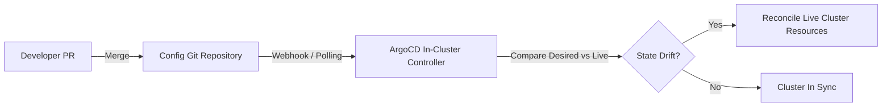

# ADR-0015: Declarative GitOps Continuous Delivery Architecture

* Status: accepted
* Deciders: Platform Architecture WG, Release Engineering Guild, Security Team
* Date: 2024-07-17
Technical Story: PLAT-202
* Category: Deployment Infrastructure
* Supersedes: ADR-0003
* Depends on: ADR-0004
* Required by: ADR-0012, ADR-0013, ADR-0027, ADR-0030

## Context and Problem Statement

Traditional imperative CI/CD pipelines pushed deployments directly to clusters by running deployment scripts using high-privilege cluster admin credentials embedded in CI runners. This approach lacked reconciliation against out-of-band manual changes, exposed cluster credentials to CI runner vulnerabilities, and made catastrophic cluster recovery complex and error-prone.

## Decision Drivers

* Git as the single, auditable source of truth for desired infrastructure and application state
* Pull-based reconciliation model eliminating external cluster administrative credentials in CI
* Continuous drift detection and automated remediation against manual cluster changes

## Considered Options

* Option 1: Pull-Based GitOps Continuous Delivery (ArgoCD / Flux)
* Option 2: Push-Based CI Deployments (CI Runner Direct Push)

## Decision Outcome

Chosen option: "Pull-Based GitOps Continuous Delivery (ArgoCD / Flux)", because Supersedes ADR-0003 and depends on ADR-0004. GitOps establishes an airtight, cryptographically signed audit trail where git history is the exact mirror of live cluster topology, while isolating cluster control planes from CI execution environments.

### Positive Consequences

* Completely eliminated write credentials to clusters from external CI workers.
* Drift detection immediately alerts or reverts unauthorized manual cluster edits.
* Entire cluster workloads can be recovered in a new cloud region in under 15 minutes by applying the root GitOps manifest.

### Negative Consequences

* Developers cannot perform quick manual hotfixes in staging or production; all edits must traverse git pull requests.
* Repository structure requires disciplined separation between application code repos and environment config repos.

### Architecture Topology

## Pros and Cons of the Options

### Option 1: Pull-Based GitOps Continuous Delivery (ArgoCD / Flux)

An in-cluster controller monitors a declarative git repository containing Helm manifests, continuously reconciling live cluster state against the git repository.

* Good, because CI runners require zero cluster credentials; they only commit to git
* Good, because Every production deployment is an auditable git commit with author and review signoff
* Good, because Disaster recovery cluster re-hydration is achieved simply by pointing ArgoCD to the repo
* Bad, because Slight synchronization delay (1-2 minutes) unless git webhook triggers are configured
* Bad, because Learning curve for developers used to imperative CLI deployments

### Option 2: Push-Based CI Deployments (CI Runner Direct Push)

CI runners execute deployment scripts over cluster API endpoints.

* Good, because Direct step-by-step pipeline execution visibility
* Bad, because Security risk: cluster credentials distributed across multiple CI runners
* Bad, because Cannot detect or heal manual drift introduced during live emergency debugging

## Links and Primary Sources

### Internal Platform Links
* [ADR-0003: Direct Host Process Execution on Persistent Instances](0003-direct-host-process-execution.md)
* [ADR-0004: Immutable Digest Container Promotion Lifecycle](0004-immutable-digest-container-promotion.md)

### Canonical Primary Sources
* [OpenGitOps Principles Specification](https://opengitops.net)

