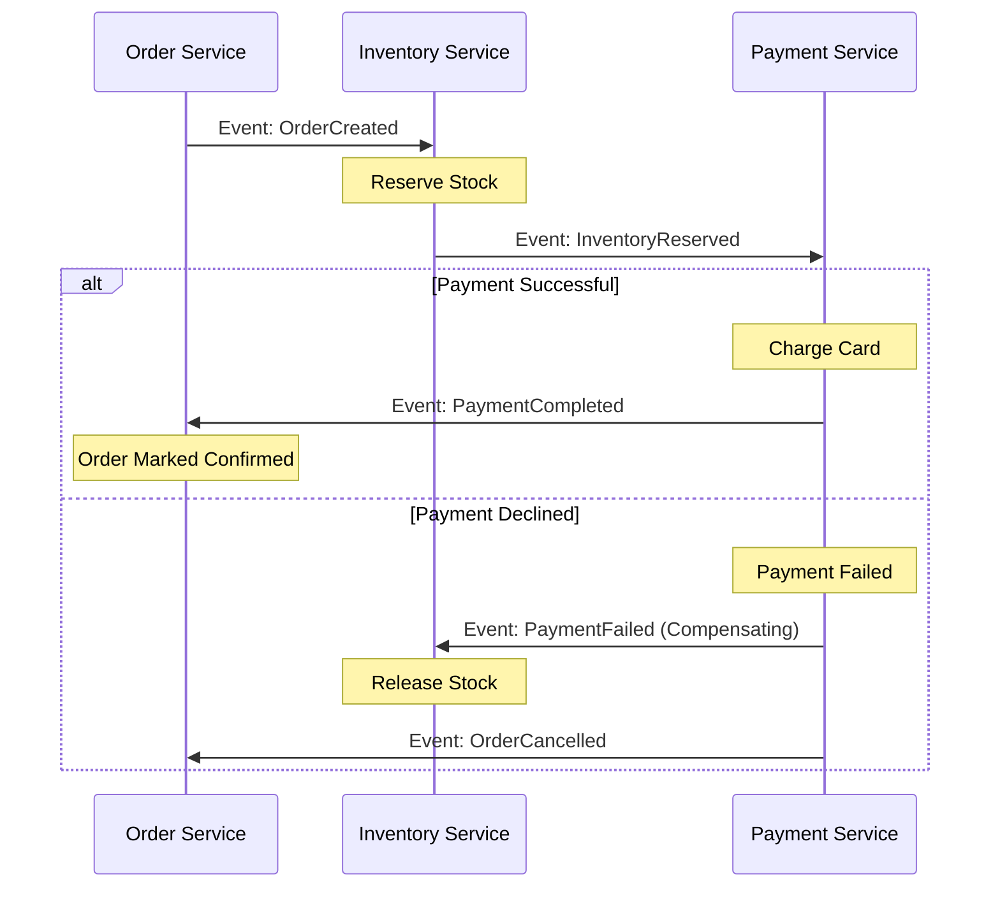

# ADR-0020: Distributed Saga Pattern for Cross-Service Coordination

* Status: accepted
* Deciders: Distributed Systems WG, Financial Services Architecture
* Date: 2024-09-25
Technical Story: PLAT-240
* Category: Distributed Systems
* Depends on: ADR-0019

## Context and Problem Statement

Complex business transactions spanning multiple microservices (e.g., reserving inventory, processing credit card charges, updating account balances, and generating shipment labels) required atomic consistency. Traditional distributed two-phase commit (2PC / XA) protocols caused severe database locking, reduced throughput, and created brittle failure modes across microservice boundaries.

## Decision Drivers

* Maintain eventual business consistency across autonomous microservice boundaries
* Eliminate distributed lock contention and single points of failure in transactional coordinators
* Provide deterministic compensation mechanisms to rollback partial failures gracefully

## Considered Options

* Option 1: Choreographed Saga Pattern via Kafka Event Streams
* Option 2: Orchestrated Saga with Central Workflow Engine (Temporal / Camunda)

## Decision Outcome

Chosen option: "Choreographed Saga Pattern via Kafka Event Streams", because Depends on ADR-0019. Event-driven choreography maximizes service autonomy and write throughput, avoiding synchronous coordinator lock-in while leveraging Kafka durable log guarantees for compensating workflows.

### Positive Consequences

* High-throughput business transactions execute asynchronously without distributed locks.
* Partial failures (e.g., payment declined after inventory reservation) trigger automated compensating refund and release events.
* System availability remains resilient even if non-critical downstream saga participants experience temporary outages.

### Negative Consequences

* Requires comprehensive OpenTelemetry trace propagation to observe multi-stage saga execution.
* Developers must carefully write idempotent compensating actions for every forward state mutation.

### Architecture Topology

## Pros and Cons of the Options

### Option 1: Choreographed Saga Pattern via Kafka Event Streams

Services react to domain events on Kafka topics, perform local database transactions, and publish subsequent state events. If a downstream step fails, compensating events are published to reverse preceding actions.

* Good, because No centralized coordinator bottleneck or single point of failure
* Good, because Services remain completely decoupled, reacting solely to event domain transitions
* Good, because Naturally aligned with asynchronous Kafka event streaming architecture
* Bad, because Complex workflow visibility: tracking end-to-end saga status requires distributed tracing correlation
* Bad, because Risk of cyclic event loops if event schemas and transitions are poorly designed

### Option 2: Orchestrated Saga with Central Workflow Engine (Temporal / Camunda)

A centralized workflow engine coordinates steps and invokes service RPC endpoints sequentially.

* Good, because Explicit state machine visibility in a central UI
* Good, because Simplified error handling and timeout management
* Bad, because Introduces central workflow engine infrastructure dependency
* Bad, because Tighter coupling between orchestrator and service interfaces

## Links and Primary Sources

### Internal Platform Links
* [ADR-0005: Stateless Service Architecture and Session Externalization](0005-stateless-service-session-externalization.md)
* [ADR-0019: Asynchronous Event Streaming Architecture via Apache Kafka](0019-event-driven-streaming-architecture-kafka.md)

### Canonical Primary Sources
* [Pattern: Saga in Distributed Architectures](https://microservices.io/patterns/data/saga.html)

