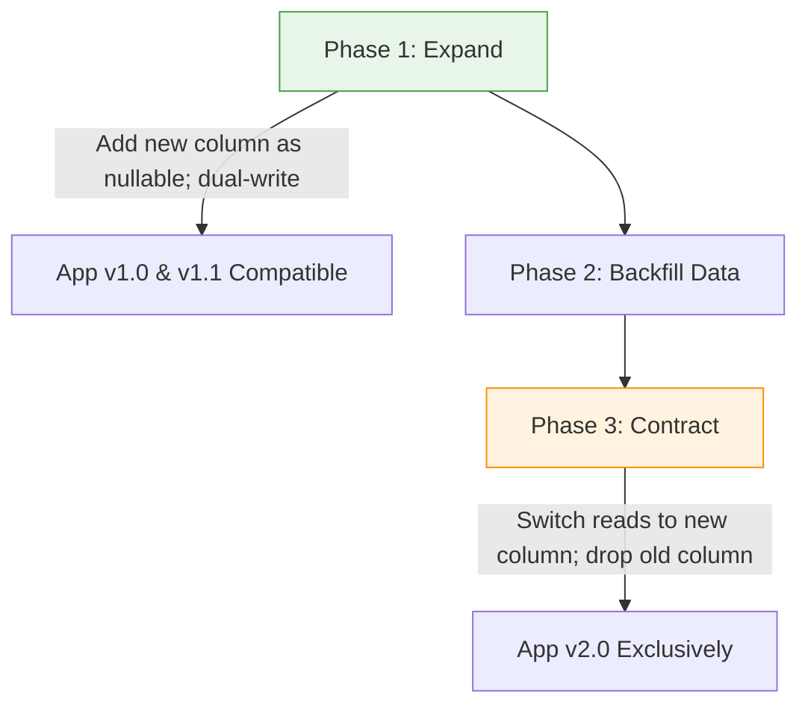

# ADR-0022: Expand-Contract Schema Evolution for Zero Downtime

* Status: accepted
* Deciders: Data Architecture WG, Release Engineering Guild
* Date: 2024-10-23
Technical Story: PLAT-255
* Category: Persistence Architecture
* Supersedes: ADR-0008
* Required by: ADR-0027

## Context and Problem Statement

As analyzed in ADR-0008, destructive schema migrations (renaming columns, dropping fields, changing data types) on shared relational databases required maintenance downtime windows. When services deployed in rolling waves, older running pods crashed when encountering unexpected schema changes introduced by newer database migrations.

## Decision Drivers

* Continuous deployment without scheduled maintenance or downtime windows
* Backward and forward database schema compatibility across rolling deployment phases
* Zero locking of high-volume transactional tables during migration execution

## Considered Options

* Option 1: Three-Phase Expand-and-Contract Migration Pattern
* Option 2: In-Place Direct Migrations with Maintenance Downtime Windows

## Decision Outcome

Chosen option: "Three-Phase Expand-and-Contract Migration Pattern", because Supersedes ADR-0008. Continuous delivery requires that database schemas and application code deploy asynchronously. Expand-and-contract eliminates database maintenance windows entirely.

### Positive Consequences

* Eliminated scheduled maintenance downtime across all production databases.
* Deployment rollbacks become safe and non-destructive since old columns remain intact during releases.
* Database DDL locks are restricted to non-blocking additive operations.

### Negative Consequences

* Developers must plan schema evolutions across a minimum of two separate release cycles.
* Temporary database storage overhead while duplicate columns are maintained during backfills.

### Architecture Topology

## Pros and Cons of the Options

### Option 1: Three-Phase Expand-and-Contract Migration Pattern

Decompose all schema changes into three discrete releases: 1) Expand: add new nullable column/table and write to both old and new; 2) Migrate: backfill existing data; 3) Contract: update readers to new column, stop dual-writing, and drop legacy column in a subsequent release.

* Good, because Guarantees zero downtime: both old and new application versions run simultaneously
* Good, because Safe rollbacks at any point without data corruption
* Good, because Enforces decoupled schema evolution across continuous deployment pipelines
* Bad, because Increases release cycle overhead: schema changes span multiple sequential pull requests
* Bad, because Requires dual-writing logic during transitional migration phases

### Option 2: In-Place Direct Migrations with Maintenance Downtime Windows

Lock tables and apply DDL mutations during scheduled weekend maintenance periods.

* Good, because Simpler one-step migration scripts without dual-write complexity
* Bad, because Unacceptable customer downtime violating 99.95% availability SLAs
* Bad, because High operational stress during rollback failures

## Links and Primary Sources

### Internal Platform Links
* [ADR-0008: Monolithic Shared Relational Database Schema](0008-monolithic-shared-relational-database.md)
* [ADR-0027: Dual-Region Warm-Standby Disaster Recovery Topology](0027-dual-region-disaster-recovery-topology.md)

### Canonical Primary Sources
* [Refactoring Databases: Evolutionary Database Design](https://martinfowler.com/articles/evodb.html)

